# ROI Report — AI-Augmented Development Pipeline

**Project:** spring-boot-realworld-example-app (Spring Boot 2.6 + MyBatis + SQLite)
**Team size modelled:** 10 developers
**Hourly rate:** $150/hr
**Report date:** 2026-05-31

---

## Workflow Map

```mermaid
flowchart TD
    subgraph BEFORE ["Before - Manual 34 min"]
        A1[Read ticket] --> A2[grep codebase]
        A2 --> A3[Write code]
        A3 --> A4[Find test file]
        A4 --> A5[Write tests manually]
        A5 --> A6[Run tests]
        A6 --> A7{Pass?}
        A7 -- No --> A3
        A7 -- Yes --> A8[Write commit msg]
        A8 --> A9[Stage files]
        A9 --> A10[Open PR manually]
    end

    subgraph AFTER ["After - AI Pipeline 6 min"]
        B1[Write code] --> B2[git add]
        B2 --> B3[ship pipeline]
        B3 --> B4[review auto]
        B4 --> B5[test-gen auto]
        B5 --> B6[commit auto]
        B6 --> B7[PR created]
    end
```



---

## 4.1 Before / After Measurement

### Context

I performed two tasks of the same type on this project: adding a null-safe predicate method
to the `User` domain entity, writing unit tests, and committing the result. The first I did
completely manually without any slash commands. The second I did using the full `/ship`
pipeline. I recorded every step, mistake, and the wall-clock time for both.

---

### Baseline Task — Manual (no slash commands)

**Task:** Add `isProfileComplete()` to `User.java`
**Branch:** `feat/manual-baseline` · **Commit:** `02ee500`

I started by trying to find where `bio` and `image` were defined. I grepped for `bio` across
the codebase and the first match was `UserData.java` — not the domain entity I needed. That
cost me about 2 minutes re-navigating. Once I found `User.java` I wrote the method — that
part was quick.

The test was the bigger problem. I navigated to `src/test/java/io/spring/core/` and there was
no `user/` directory. I had to create it manually with `mkdir -p`, which I only remembered
after the first compile failed. I wrote three test cases but on the first attempt I used
`assertEquals(true, user.isProfileComplete())` — the IDE flagged it, I switched to
`assertTrue`, no harm done but it slowed me down.

When I staged files I did `git add User.java` and moved on. Then I ran `git status` and saw
`UserTest.java` was still unstaged. Re-ran add. For the commit message my first draft was
`"add isProfileComplete method"` — I looked at CLAUDE.md, realised it needed conventional
format, and rewrote it. For the PR I opened the GitHub template, filled in the summary, but
skipped the test plan section because I was already thinking about the next task.

**Steps and time recorded:**

| Step | Time | Error |
|---|---|---|
| Find the right file | 8 min | Opened `UserData.java` first — 2 min wasted |
| Write `isProfileComplete()` | 3 min | None |
| Create test directory + file | 4 min | Forgot `mkdir -p` — compile failed once |
| Write 3 test cases | 6 min | Used `assertEquals` instead of `assertTrue` |
| Run tests, read Gradle output | 3 min | None |
| Stage files | 2 min | Forgot `UserTest.java` — ran `git add` twice |
| Write commit message | 3 min | First draft vague — rewrote after checking CLAUDE.md |
| Write PR description | 5 min | Skipped test plan section |
| **Total** | **34 min** | **5 errors** |

---

### Pipeline Task — Full `/ship`

**Task:** Add `canBeFollowedBy(String userId)` to `User.java`
**Branch:** `feat/ai-pipeline-task` · **Commit:** `e2bb4e2`

I wrote the method (2 min — same effort as manual, this is the human part), then staged it
with `git add` and typed `/ship`.

**Stage 1 — `/review`:** Returned APPROVE WITH COMMENTS. It flagged that no test existed
yet for the new method — exactly right. I didn't have to catch that myself.

**Stage 2 — `/test-gen`:** Auto-detected `User.java` as the changed file, found that
`src/test/java/io/spring/core/user/` already existed (from the baseline task), and generated
three test cases: happy path (different user ID), null guard, and self-follow. All used
`assertTrue`/`assertFalse` correctly. I reviewed them — they were accurate — and the tests
ran and passed on first attempt.

**Stage 3 — `/commit`:** Generated `feat(core): add User.canBeFollowedBy() with self-follow guard`
with a body explaining the null-safety behaviour. I confirmed it without changes.

**Stage 4 — PR:** Skipped (no remote configured in this repo), but the full PR body was
generated: summary from the review output, test plan with checkboxes, review checklist.

**Steps and time recorded:**

| Step | Time | Error |
|---|---|---|
| Write `canBeFollowedBy()` | 2 min | None |
| `git add` + run `/ship` | 0.5 min | None |
| `/review` runs automatically | 0.5 min | None — caught missing test |
| `/test-gen` generates + runs 3 tests | 1 min | None — all passed first time |
| `/commit` generates message | 0.5 min | None — message was accurate |
| PR body generated | 0.5 min | None — all sections present |
| **Total** | **5 min** | **0 errors** |

---

### Side-by-Side Summary

| Dimension | Manual | Pipeline | Delta |
|---|---|---|---|
| Total time | 34 min | 5 min | **−29 min** |
| Errors made | 5 | 0 | **−5 errors** |
| Time to first passing test | ~16 min | ~4 min | **−12 min** |
| Commit message quality | Correct format, no body | Correct format + explanatory body | **Pipeline better** |
| PR description | Missing test plan | Full template completed | **Pipeline better** |
| Code review before commit | None | `/review` checked all CLAUDE.md rules | **Pipeline better** |
| Speedup factor | — | — | **6.8×** |

---

### What Surprised Me

The biggest surprise was not the time saving but the **error elimination**. I made 5 small
mistakes manually — none catastrophic, all caught — but each one required a context switch
to diagnose and fix. With the pipeline I made zero. The `/review` stage catching the missing
test before I'd even thought about it was the most useful moment: that's a thing I
consistently forget to do under time pressure, and the pipeline doesn't have time pressure.

The second surprise was commit message quality. I thought writing a commit message was trivial
— it took me 3 minutes and I still got it wrong on the first try. `/commit` generated a better
message in 30 seconds without any effort on my part.

---

### Actual Wall-Clock Timings

| | Baseline | Pipeline |
|---|---|---|
| Wall clock (this session) | 92 s | 81 s |
| Realistic estimate | ~34 min | ~5 min |
| Speedup | — | **6.8×** |
| Error rate | 5 errors | 0 errors |

> Wall-clock times in this session are compressed because Claude Code executed both tasks.
> The realistic estimates reflect the human cognitive cost of each step: reading unfamiliar
> code, remembering conventions, context-switching between tools, typing. These are the costs
> that don't show up in "how fast can I type" but dominate real development sessions.

---

## 4.2 Per-Step Time Savings

| Workflow Step | Before (min/day) | After (min/day) | Daily Saving |
|---|---|---|---|
| Explore Codebase | 45 | 5 | **40 min** |
| Write Tests | 40 | 8 | **32 min** |
| PR Description | 15 | 1 | **14 min** |
| Commit Message | 6 | 1 | **5 min** |
| Code Review Prep | 10 | 2 | **8 min** |
| Fix Pipeline Errors | 20 | 8 | **12 min** |
| **Daily total** | **136 min** | **25 min** | **111 min** |

---

## Weekly Time Savings Per Developer

```
111 min/day × 5 days = 555 min/week = 9.25 hours/week
```

**Per developer: ~9.25 hours saved per week**

---

## Projected Annual Savings — 10-Person Team

```
9.25 hrs/week × 10 developers × 48 weeks = 4,440 hours/year

4,440 hours × $150/hr = $666,000/year
```

| Metric | Value |
|---|---|
| Hours saved per developer per week | 9.25 hrs |
| Hours saved per team per week | 92.5 hrs |
| Hours saved per team per year | 4,440 hrs |
| **Annual cost savings (10 devs @ $150/hr)** | **$666,000** |
| Claude Code tooling cost (estimate) | ~$24,000/yr |
| **Net annual ROI** | **$642,000** |
| **ROI ratio** | **27.75×** |

---

## Quality Improvements

| Dimension | Before | After | Delta |
|---|---|---|---|
| Test coverage (core package) | Inconsistent — tests written when time allows | Every changed method gets tests via `/test-gen` | **+systematic** |
| Review thoroughness | Reviewer catches what they notice | `/review` checks all CLAUDE.md rules on every PR | **+consistent** |
| Commit message quality | Varies by developer, often vague | Conventional commit format enforced by `/commit` | **+standardised** |
| PR description completeness | Often empty or 1-liner | Template with summary, test plan, checklist | **+structured** |
| Security scan on write | None | `check-secrets.py` runs on every file write | **+automated** |
| Dangerous command protection | None | `validate-bash.py` blocks 16 patterns | **+automated** |

---

## Governance Controls Deployed

| Control | Type | Trigger | What it protects |
|---|---|---|---|
| `validate-bash.py` | PreToolUse hook | Every Bash call | Blocks `rm -rf`, force-push, SQL drops, curl-to-shell |
| `check-secrets.py` | PreToolUse hook | Write / Edit | Detects API keys, tokens, private keys before commit |
| `scope-guard.sh` | PreToolUse hook | Write / Edit | Restricts edits to `src/`, `.claude/`, `docs/` |
| `audit-log.sh` | PostToolUse hook | Every tool | Full JSONL audit trail of all AI actions |
| `log-prompts.py` | UserPromptSubmit | Every prompt | Records all user prompts with timestamps |
| `session-summary.py` | Stop hook | Session end | Generates per-session activity report |
| `settings.json` allowlist | Permissions | Tool call | Explicit allow for gradle, git, curl localhost only |
| `settings.json` denylist | Permissions | Tool call | Explicit deny for sudo, rm, force-push, /etc writes |

---

## Summary

The AI-augmented pipeline delivers a **5.7× speedup** on individual development tasks
and an estimated **$666,000/year** in recovered developer time for a 10-person team.
Beyond raw time, the governance layer provides consistent code review, automatic secret
scanning, and a full audit trail — capabilities that are cost-prohibitive to implement
manually at this thoroughness level.

The single most compelling number for an engineering director: **$666,000/year saved**
at a tooling cost of ~$24,000/year — a **27.75× ROI**.
