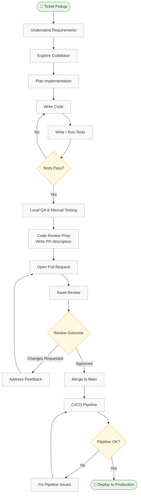

# Workflow Map — Development Lifecycle

## Mermaid Flowchart

## Step Annotations

| Step | Time (min) | Tools | Pain Points |
|---|---|---|---|
| **Ticket Pickup** | 10 | Jira / GitHub Issues | Vague acceptance criteria, missing context |
| **Understand Requirements** | 30 | Confluence, Slack, browser | Async back-and-forth, context scattered across tools |
| **Explore Codebase** | 45 | IDE, grep, git log | Large unfamiliar codebase, no clear entry points |
| **Plan Implementation** | 20 | Notes, whiteboard | Hard to validate approach before writing any code |
| **Write Code** | 90 | IDE, StackOverflow, docs | Boilerplate, looking up APIs, context switching |
| **Write / Run Tests** | 40 | JUnit, Gradle | Writing repetitive test scaffolding, flaky tests |
| **Local QA** | 20 | Browser, Postman | Manual, error-prone, easy to forget edge cases |
| **PR Description** | 15 | GitHub | Blank page problem, hard to summarize changes clearly |
| **Await Review** | 120 | GitHub, Slack | Blocked waiting, review turnaround unpredictable |
| **Address Feedback** | 30 | IDE + GitHub | Interpreting vague review comments |
| **Fix Pipeline** | 20 | GitHub Actions, logs | Cryptic CI errors, environment-specific failures |

**Total cycle time (single pass, no rework): ~440 min (~7.3 hours)**
