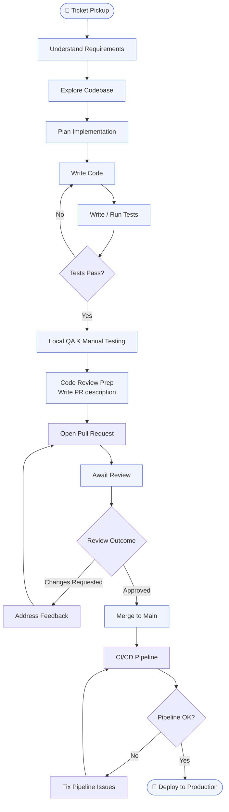

# Part 1: Workflow Mapping & Analysis

## 1.1 Development Workflow Flowchart

| Step | Time (min) | Tools | Pain Points |
|---|---|---|---|
| **Ticket Pickup** | 10 | Jira / GitHub Issues | Vague acceptance criteria, missing context |
| **Understand Requirements** | 30 | Confluence, Slack, browser | Async back-and-forth, context scattered across tools |
| **Explore Codebase** | 45 | IDE, grep, git log | Large unfamiliar codebase, no clear entry points |
| **Plan Implementation** | 20 | Notes, whiteboard | Hard to validate approach before writing any code |
| **Write Code** | 90 | IDE, StackOverflow, docs | Boilerplate, looking up APIs, context switching |
| **Write / Run Tests** | 40 | JUnit, Gradle | Writing repetitive test scaffolding, flaky tests |
| **Local QA** | 20 | Browser, Postman | Manual, error-prone, easy to forget edge cases |
| **PR Description** | 15 | GitHub | Blank page problem, hard to summarize changes clearly |
| **Await Review** | 120 | GitHub, Slack | Blocked waiting, review turnaround unpredictable |
| **Address Feedback** | 30 | IDE + GitHub | Interpreting vague review comments |
| **Fix Pipeline** | 20 | GitHub Actions, logs | Cryptic CI errors, environment-specific failures |

---

## 1.2 Automation Leverage Analysis

| Step | Frequency | Time/occurrence | AI Capability | ROI Score |
|---|---|---|---|---|
| Understand Requirements | Daily | 30 min | High | 8 |
| Explore Codebase | Daily | 45 min | Very High | 9 |
| Write Code | Daily | 90 min | Very High | 9 |
| Write Tests | Daily | 40 min | Very High | 9 |
| Local QA | Daily | 20 min | Medium | 6 |
| PR Description | Daily | 15 min | Very High | 9 |
| Await Review | Daily | 120 min | Low | 2 |
| Address Feedback | Weekly | 30 min | High | 7 |
| Plan Implementation | Daily | 20 min | High | 8 |
| Fix Pipeline | Weekly | 20 min | Medium | 6 |

---

## Top 3 Automation Targets

### 1. Explore Codebase (ROI: 9)

Highest single time sink for any new ticket (~45 min). Claude Code's ability to semantically
search, explain architecture, trace call paths, and identify relevant files turns this from a
manual treasure hunt into a 5-minute conversation. Frequency × time = highest raw minutes
recoverable per day.

### 2. Write Tests (ROI: 9)

Test scaffolding is highly formulaic — given a method's signature and behavior, the structure
of unit and integration tests is almost deterministic. AI capability is very high here
(repetitive patterns, no creativity required). Generates immediately runnable code with minimal
review needed.

### 3. PR Description (ROI: 9)

Extremely high AI capability (reads the diff, writes the summary), near-zero human value in
the writing itself. Takes 15 min manually, takes 30 seconds with automated tooling. Done daily,
the compound saving is significant.
